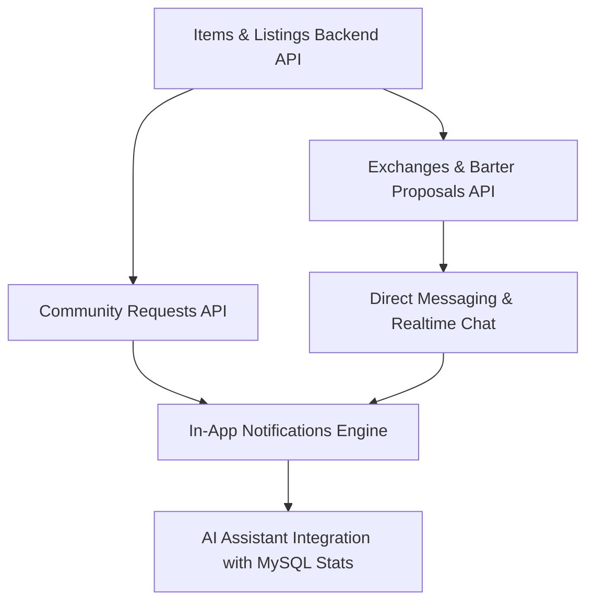

# Bayanihan Hub — Engineering Roadmap & Tasks for Tomorrow
**Date:** September 6, 2026  
**Repository:** [https://github.com/Jehooooo/BayanihanHub.git](https://github.com/Jehooooo/BayanihanHub.git)  
**Database:** MySQL 8.4 (3NF Relational Architecture via Laragon / Native MySQL)  
**Backend:** FastAPI (Python 3.12+ / SQLAlchemy 2.0 / PyMySQL)  
**Frontend:** React 19 + TypeScript + Vite + Zustand + Tailwind CSS  

---

## Executive Summary & Current System Status

### ✅ What Has Been Accomplished & Verified:
1. **Strict 3NF MySQL Relational Database Architecture**:
   - 26 normalized tables deployed with primary keys, foreign keys, constraints, enum lookups, and audit logging (`backend/db/schema.sql`).
   - Default seed data created with proper role lookups (`admin`, `moderator`, `user`), account statuses (`PENDING`, `APPROVED`, `REJECTED`, `REQUIRES_REVIEW`), Philippine ID types, and sample profiles.
2. **Registration & Identity Verification Lifecycle**:
   - Multi-step registration flow: Account Information → Philippine ID selection → ID details & card photo upload → Facial selfie capture → Verification submission.
   - **Critical Enforced Policy**: All registered accounts are strictly inserted into MySQL `users` with `account_status_id = 1 (PENDING)` and `is_verified = FALSE`. Auto-login is completely blocked.
   - Login attempts with `PENDING` or `REJECTED` accounts return HTTP 401/403 with clear user guidance.
3. **Admin Identity Verification Review Dashboard**:
   - Administrator dashboard (`/admin/approvals`) dynamically queries MySQL backend (`/api/verification/applications`).
   - Actions to **Approve**, **Reject**, or **Request Retry** update the MySQL database in real time and write to `audit_logs`.
   - Once approved by an admin, the user account transitions to `APPROVED` in MySQL, allowing the user to log in successfully.
4. **Environment & Laragon Setup**:
   - Laragon MySQL 8.4 port configured and tested.
   - Backend health check route `/api/db-health` responds with connection telemetry.
   - Synchronized root workspace and nested `BayanihanHub/` workspace.

---

## 🎯 Priority Tasks for Tomorrow



---

### Priority 1: Items & Postings MySQL Backend Integration
**Goal:** Transition item postings (Donations, Exchanges, Requests) from in-memory Zustand mocks to persistent MySQL tables (`items`, `item_images`, `item_categories`, `item_conditions`, `saved_items`).

- [ ] **Backend Router (`backend/app/routers/items.py`)**:
  - `GET /api/items`: List items with filtering (category, condition, listing_type, barangay/city, search keyword, pagination).
  - `GET /api/items/{item_id}`: Fetch single item details with joined seller profile, category, condition, and image gallery.
  - `POST /api/items`: Create item posting linked to authenticated `user_id`, saving uploaded images to `item_images`.
  - `PUT /api/items/{item_id}`: Update listing details, condition, availability status (`AVAILABLE`, `RESERVED`, `COMPLETED`, `ARCHIVED`).
  - `DELETE /api/items/{item_id}`: Soft-delete or archive listing.
  - `POST /api/items/{item_id}/save` & `DELETE /api/items/{item_id}/save`: Bookmark / save item into `saved_items` table.
- [ ] **Frontend Integration**:
  - Update `src/services/items.service.ts` to call `/api/items`.
  - Update `src/features/items/pages/PostItemPage.tsx` to submit form data and Base64/multipart images to backend.
  - Update `src/features/items/pages/BrowsePage.tsx` and `ItemDetailsPage.tsx` to display real database items.
  - Update `src/stores/savedItemsStore.ts` to persist bookmarks to backend.

---

### Priority 2: Community Exchanges & Barter Proposals Workflow
**Goal:** Implement the complete peer-to-peer exchange and negotiation cycle in MySQL (`exchanges`, `exchange_items`, `exchange_messages`).

- [ ] **Backend Router (`backend/app/routers/exchanges.py`)**:
  - `POST /api/exchanges`: Submit a trade proposal specifying requested item, offered items, and barter terms.
  - `GET /api/exchanges`: List proposals where user is requester or recipient.
  - `POST /api/exchanges/{id}/accept`: Accept exchange proposal, update item availability to `RESERVED`.
  - `POST /api/exchanges/{id}/decline`: Reject proposal with optional reason.
  - `POST /api/exchanges/{id}/counter`: Counter-offer alternative exchange items.
  - `POST /api/exchanges/{id}/complete`: Mark exchange completed, update items to `COMPLETED`, prompt for rating & review.
- [ ] **Frontend Integration**:
  - Update `src/services/exchange.service.ts` and `src/features/exchange/pages/ExchangePage.tsx` to bind directly to `/api/exchanges`.
  - Ensure trade proposal cards display live user profiles and real item images from MySQL.

---

### Priority 3: Community Assistance & Help Requests
**Goal:** Connect community requests (calamity aid, supplies, medical necessities) to the `community_requests` table.

- [ ] **Backend Router (`backend/app/routers/requests.py`)**:
  - `GET /api/requests`: Retrieve community requests sorted by urgency (`CRITICAL`, `HIGH`, `MEDIUM`, `LOW`) and status (`OPEN`, `IN_PROGRESS`, `FULFILLED`, `CANCELLED`).
  - `POST /api/requests`: Submit request with urgency, target beneficiary count, description, and location.
  - `POST /api/requests/{id}/fulfill`: Offer assistance / fulfill request.
- [ ] **Frontend Integration**:
  - Update `src/services/requests.service.ts` and `src/features/requests/pages/RequestsPage.tsx` to load and post to backend.

---

### Priority 4: Direct Messaging & Real-Time Communications
**Goal:** Wire user-to-user messaging into `conversations`, `conversation_participants`, and `direct_messages`.

- [ ] **Backend Router (`backend/app/routers/messaging.py`)**:
  - `GET /api/conversations`: List active chat threads with unread counts and last message snippet.
  - `POST /api/conversations`: Start or get conversation between two verified users.
  - `GET /api/conversations/{id}/messages`: Fetch chronological message history with pagination.
  - `POST /api/conversations/{id}/messages`: Send message with status tracking (`SENT`, `DELIVERED`, `READ`).
  - Optional WebSocket endpoint `/ws/chat/{conversation_id}` for instant message delivery without polling.
- [ ] **Frontend Integration**:
  - Update `src/stores/chatStore.ts` and `src/features/messaging/pages/MessagingPage.tsx`.

---

### Priority 5: Notifications & Status Change Triggers
**Goal:** Automatically notify users when administrators act on their verification, or when exchanges/messages occur (`notifications` table).

- [ ] **Backend Notification Service (`backend/app/services/notifications.py`)**:
  - Trigger notification when identity verification is Approved, Rejected, or Requires Retry.
  - Trigger notification when an exchange proposal is received, accepted, or declined.
  - Trigger notification on new direct message.
  - Endpoints: `GET /api/notifications` and `PATCH /api/notifications/{id}/read`.
- [ ] **Frontend Integration**:
  - Update `src/stores/notificationStore.ts` and `src/features/notifications/pages/NotificationsPage.tsx`.

---

### Priority 6: User Profile Management & Avatar Approval Lifecycle
**Goal:** Complete profile updates, address updates, and avatar image approval workflow.

- [ ] **Backend Profile Endpoints (`backend/app/routers/profile.py`)**:
  - `GET /api/users/profile/{id}`: Fetch public or private profile details.
  - `PUT /api/users/profile`: Update bio, contact phone, barangay, municipality, province.
  - `POST /api/users/profile/avatar`: Upload new profile avatar. Follow community safety policy: avatar goes to `profile_pictures` as `PENDING` until admin approves.
  - `GET /api/admin/avatars`: Admin endpoint to review pending profile pictures.
- [ ] **Frontend Integration**:
  - Update `src/features/profile/pages/ProfilePage.tsx` and `SettingsPage.tsx`.
  - Update `src/stores/profilePictureStore.ts`.

---

### Priority 7: AI Assistant Integration with Real Database Statistics
**Goal:** Integrate the community AI Assistant with live MySQL statistics (as specified in `TASKS.md`, section 2).

- [ ] **Backend Router (`backend/app/routers/ai.py`)**:
  - Query actual database metrics:
    - Total posted items (`SELECT COUNT(*) FROM items WHERE status_id = ...`)
    - Total completed exchanges (`SELECT COUNT(*) FROM exchanges WHERE status_id = ...`)
    - Total fulfilled community requests (`SELECT COUNT(*) FROM community_requests WHERE status_id = ...`)
    - Active barangay communities represented.
  - Connect Gemini API or local assistant prompt scoped strictly to Bayanihan Hub community guidelines.
- [ ] **Frontend Integration**:
  - Floating or embedded AI Community Chatbot widget querying `/api/ai/chat`.

---

## 🧪 Verification & Quality Assurance Checklist for Tomorrow

| Area | Test Scenario | Expected Outcome | Status |
|---|---|---|:---:|
| **Auth** | Register new user via browser | Stored in MySQL `users` as `PENDING`; auto-login blocked | ✅ Verified |
| **Auth** | Attempt login with `PENDING` user | Returns 401/403 with pending notice | ✅ Verified |
| **Admin** | Approve user verification in `/admin/approvals` | MySQL updated to `APPROVED`; audit log logged | ✅ Verified |
| **Auth** | Login with approved user | Returns 200 OK with session token & profile | ✅ Verified |
| **Items** | Post new donation item with images | Stored in MySQL `items` and `item_images` | ⏳ Pending |
| **Items** | Browse items with category/location filter | Filtered results returned from MySQL query | ⏳ Pending |
| **Exchanges** | Propose trade on an exchange listing | Row added to `exchanges` and `exchange_items` | ⏳ Pending |
| **Messages** | Send message in chat thread | Saved in `direct_messages` with timestamp | ⏳ Pending |
| **Admin** | Reject identity application with reason | Status set to `REJECTED`, reason saved, user notified | ⏳ Pending |

---

## 🛠️ Quick Start Reference for Tomorrow Morning

1. **Start Laragon**: Ensure MySQL 8.4 is running (Port `3307`, User `root`, Password `""`, Database `bayanihan_hub`).
2. **Start Backend & Frontend**:
   ```bash
   npm run dev:all
   ```
3. **Verify API Docs**:
   - Backend Swagger UI: [http://localhost:3001/docs](http://localhost:3001/docs)
   - DB Health Check: [http://localhost:3001/api/db-health](http://localhost:3001/api/db-health)
   - Frontend: [http://localhost:5173](http://localhost:5173)
4. **Admin Login for Testing**:
   - Email: `admin@bayanihan.ph`
   - Password: `Password123!` (or seeded SHA-256 equivalent)
