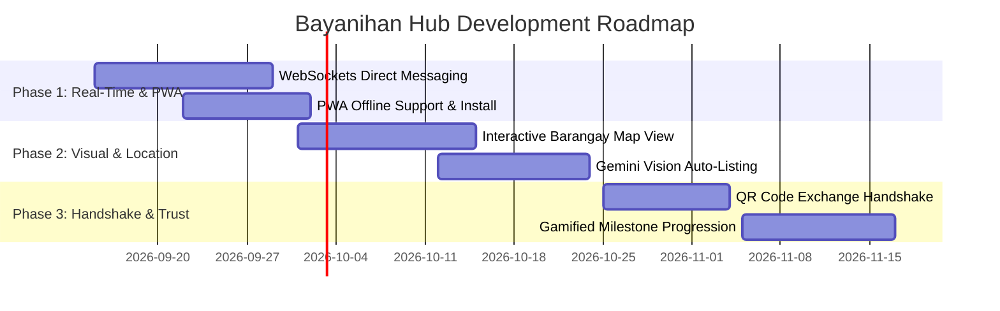

# Bayanihan Hub — Next Steps & Future Improvements Roadmap

This document outlines the strategic enhancements, architectural optimizations, and feature expansions recommended for **Bayanihan Hub** following the successful implementation and database integration of Priorities 1 through 7.

---

## 1. High-Priority Features & Enhancements

### 1.1 Real-Time WebSockets & Push Notifications
- **Current State**: Chat messages, notifications, and exchange statuses update via REST API endpoints and polling.
- **Proposed Enhancement**:
  - Implement FastAPI WebSockets (`/ws/chat/{conversation_id}` and `/ws/notifications/{user_id}`) or Server-Sent Events (SSE).
  - Add browser-level web push notifications for urgent community requests in the user's barangay and real-time chat alerts.
  - Show live "typing..." indicators and instant message delivery/read receipts across devices.

### 1.2 Interactive Map View with Proximity Radius (Leaflet / Mapbox)
- **Current State**: Items and community requests list barangay and municipality names with static text distance estimates.
- **Proposed Enhancement**:
  - Embed an interactive Leaflet/OpenStreetMap or Google Maps view on `/browse` and `/requests`.
  - Cluster item pins by barangay with color-coding:
    - 🟢 Emerald pins: Free donations
    - 🔵 Blue pins: Items for exchange
    - 🟠 Amber pins: Urgent community requests
  - Add a distance slider (e.g., *Within 1 km*, *5 km*, *10 km*) calculated via Haversine geolocation coordinates stored in MySQL.

### 1.3 AI-Powered Camera Vision for Item Listings (Gemini Vision)
- **Current State**: Users manually type item title, select categories, and pick condition when uploading item photos.
- **Proposed Enhancement**:
  - Integrate Gemini Vision API on the photo upload step of `PostItemPage`.
  - Automatically detect the item type, suggest category (`school-supplies`, `clothing`, `appliances`, etc.), infer condition (`Like New`, `Good Condition`), and auto-draft a warm community description.

---

## 2. Exchange & Safety Innovations

### 2.1 QR Code Physical Handshake Confirmation
- **Current State**: Exchanges are marked completed via button click by participants.
- **Proposed Enhancement**:
  - Generate a secure, single-use QR code for each accepted barter or donation pickup.
  - When neighbors meet at a designated barangay pickup point, the donor or offerer scans the recipient's QR code with their mobile camera.
  - Instant cryptographic handshake in MySQL transitions the exchange status to `completed`, automatically triggering rating modals and milestone points.

### 2.2 Designated Safe Barangay Exchange Zones
- **Current State**: Users type free-form address/meeting locations.
- **Proposed Enhancement**:
  - Partner with local barangay halls, covered courts, and community centers to define pre-verified **Safe Exchange Zones**.
  - Dropdown in exchange scheduling allowing users to select official, well-lit public spots with police/tanod presence.

---

## 3. Community Gamification & Trust Tiering

### 3.1 Tiered Reputation Badges & Milestone Levels
- **Current State**: Users earn static badges (`Trusted Donor`, `Community Star`).
- **Proposed Enhancement**:
  - Implement a progressive milestone system with automated award triggers:
    - **Bronze Neighbor** (1–4 donations)
    - **Silver Guardian** (5–14 donations + 4.5★ rating)
    - **Gold Pillar** (15+ donations + 10 exchanges)
    - **Barangay Hero** (3+ emergency critical request fulfillments)
  - Display animated progress bars on `ProfilePage` showing remaining points to next tier.

### 3.2 Impact Metrics & Green Carbon Savings Counter
- **Current State**: Profile and dashboard display item counts.
- **Proposed Enhancement**:
  - Calculate estimated landfill waste diverted (kg) and carbon emissions saved based on item categories (textbooks, electronics, clothing).
  - Add a community-wide counter on `LandingPage` and `DashboardPage`: *"1,420 kg waste diverted across La Union"*.

---

## 4. Mobile & Offline Experience (PWA)

### 4.1 Progressive Web App (PWA) Installation
- **Current State**: Responsive web application running on desktop and mobile browsers.
- **Proposed Enhancement**:
  - Configure `vite-plugin-pwa` with `manifest.json` and web app icons.
  - Enable "Add to Home Screen" installation on iOS and Android with full-screen native mobile display.
  - Implement Service Worker caching so users can view saved items, conversation history, and barangay emergency directory offline.

---

## 5. Security & Infrastructure Hardening

| Area | Current Implementation | Recommended Upgrade |
|---|---|---|
| **Rate Limiting** | FastAPI standard CORS | Add `slowapi` Redis rate limiter on `/api/ai/*`, `/api/auth/*`, and `/api/messaging/*` |
| **Media Storage** | Local static uploads & Base64 | Offload item photos and ID uploads to Cloudflare R2 or AWS S3 with signed URLs |
| **Audit Logs** | Admin approval tables | Add structured tamper-evident audit logging for ID verification and user suspension actions |
| **Automated Testing** | E2E Python API test scripts | Integrate Playwright browser test suite into GitHub Actions CI/CD pipeline |

---

## 6. Implementation Schedule & Roadmap

*Crafted for the Bayanihan Hub Community Platform.*
